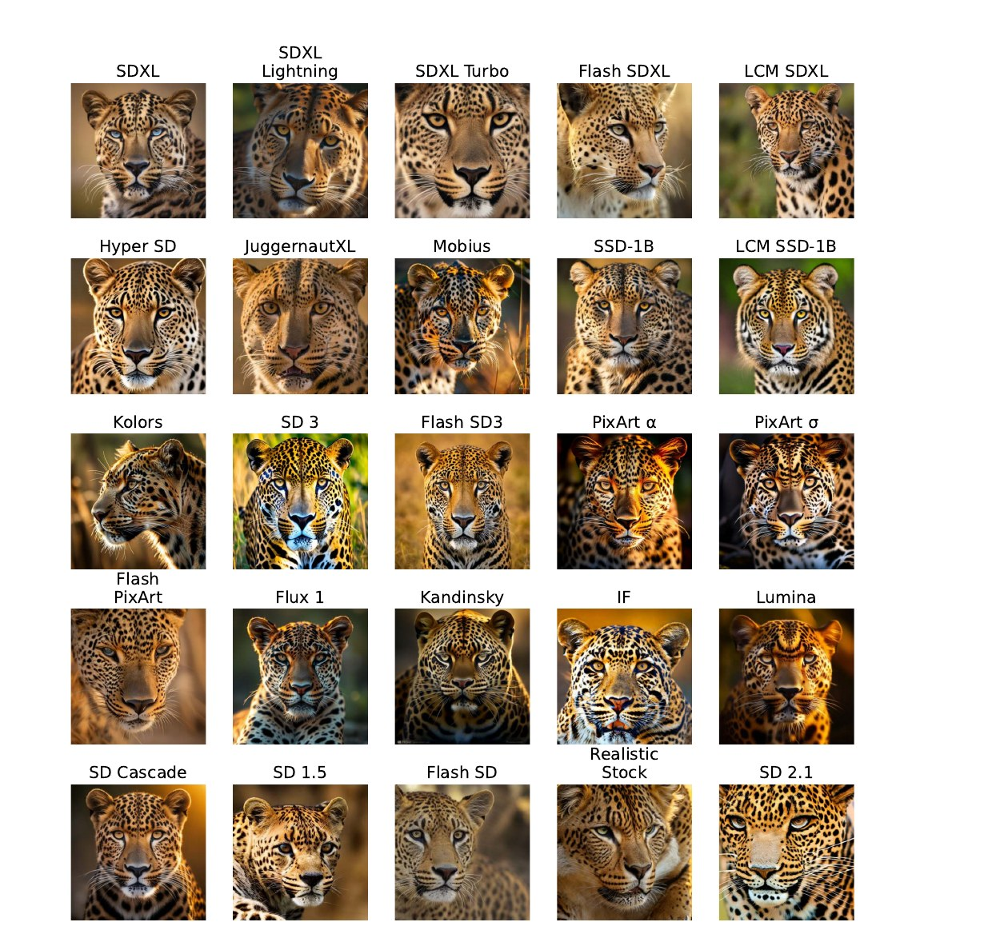

<div align="center">

# RPA: Scalable Black-Box Model Attribution for Images

**Asaf Livne** &nbsp;·&nbsp; **Amir Jevnisek** &nbsp;·&nbsp; **Shai Avidan**

*Tel Aviv University*

[](https://arxiv.org/abs/2608.15652)
[](LICENSE)
[](https://www.python.org/)
[](https://pytorch.org/)

*Attribute an image to the model that generated it — from raw pixels, with a ~6M-parameter CNN.*



<sub>Same prompt, twenty-five generators. Telling them apart is the attribution problem.</sub>

</div>

---

## 📰 News

- **[2026-08]** Code and pretrained checkpoints released.
- **[2026-08]** [arXiv preprint](https://arxiv.org/abs/2608.15652) released.

---

## 🧠 Overview

The rapid proliferation of generative models raises the **model attribution**
problem: given only an image, can we determine which model produced it?
Existing methods have grown as elaborate as the generators they target, on the
assumption that a more sophisticated generator demands a more sophisticated
attributor. **We show it does not.**

**RPA** (Raw-Patch Attribution) attributes images in the strictest black-box
setting with a lightweight CNN. Despite its simplicity it attributes more
models at higher accuracy than prior work, is data-efficient, runs at a cost
independent of the number of candidate models, and stays robust to the
compression, blur, and resizing images undergo in the wild.

Training for closed-set attribution also yields a versatile feature extractor:
the same representation recovers model lineage without supervision, flags
unseen generators, and admits new models through few-shot adaptation rather
than retraining.

### Why RPA?

- 🪶 **Small.** ~6M parameters, no pretrained encoder, no foundation-model backbone.
- 🔒 **Strictly black-box.** Image only — no generator weights, no VAE, no prompts.
- 📐 **Resolution-invariant.** 256² to 4096² without retraining; cost is independent of the number of candidate models.
- 🧩 **More than a classifier.** The same features give open-set rejection, unsupervised lineage, and few-shot adaptation for free.

---

## 🔍 Method

Three steps, one small network.

| | Step | What happens |
|:--:|:--|:--|
| **01** | **Patch division** | Split the image into fixed 256×256 RGB patches, overlapping at the edges so every pixel is covered exactly once in the weighting. |
| **02** | **Per-patch classification** | A compact ~6M-parameter CNN — four strided-conv blocks, global average pool, linear head — scores each patch against every candidate generator in one forward pass. |
| **03** | **Aggregation** | Per-patch scores combine into one image-level label via an overlap-corrected weighted average (`logit_avg`). |

---

## 📊 Results

### Black-box attribution

From the image alone, with no model access at all.

| Method | #Classes | Acc. (%) | Params (M) | Data |
|:--|:--:|:--:|:--:|:--|
| DE-FAKE | 25 | 62.0 | 151 | DRAGON |
| OCC-CLIP | 25 | 8.6 | 151 | DRAGON |
| EfficientFormer | 13 | 91.0 | 31 | Private |
| **RPA (ours)** | **25** | **98.0** | **5.9** | DRAGON |
| **RPA (ours)** | **27** | **92.9** | **5.9** | OpenFake |

### White-box comparison

On AEDR's eight-model benchmark, where competitors are given each candidate's
autoencoder. Mean pairwise accuracy and per-image inference time.

| Method | Access | Infer. (s) | Acc. (%) |
|:--|:--|:--:|:--:|
| LatentTracer | Model weights | 54.9 | 70.3 |
| AEDR | VAE weights | 0.53 | 95.1 |
| **RPA (ours)** | **Image only** | **0.0085** | **97.7** |

Two orders of magnitude faster than the closest competitor, and strictly black-box.

### Open-set & discovery

Trained on 17 of OpenFake's 27 generators, with 10 held out as unseen:

| Task | Metric |
|:--|:--|
| Rejecting unseen generators | **AU-OSCR 0.862 ± 0.040** |
| Clustering the 10 unseen sources | **ARI 0.63 · NMI 0.82 · 92 % purity** (~8 clusters recovered against 10 true sources) |

### Few-shot adaptation

Nine unseen GenImage generators, *N* labeled images per class, LIDA's protocol.
Only a linear head is fit — the backbone stays frozen.

| Method | 1-shot | 10-shot |
|:--|:--:|:--:|
| ResNet | 17.4 | 21.4 |
| DIRE | 14.3 | 17.2 |
| ESSP | 17.0 | 22.4 |
| LIDA | 40.4 | 54.0 |
| **RPA (ours, OpenFake backbone)** | 37.5 ± 4.5 | **60.3 ± 0.4** |
| **RPA (ours, DRAGON backbone)** | **38.9 ± 2.4** | 59.5 ± 1.1 |

---

## 🛠️ Installation

```bash
git clone https://github.com/Asaf-Livne/raw-patch-attribution.git
cd raw-patch-attribution
pip install -e .
```

Optional extras, each pulling in only what its entry point needs:

```bash
pip install -e ".[cluster]"    # hdbscan + umap-learn, for `cluster.py discovery`
pip install -e ".[download]"   # datasets, for `scripts/download_data.py`
pip install -e ".[plot]"       # matplotlib, for training-curve PNGs
```

---

## 🎮 Pretrained checkpoints

Both headline classifiers are published as
[release assets](https://github.com/Asaf-Livne/raw-patch-attribution/releases/tag/v1.0)
(~71 MB each), keeping the repository light.

| Checkpoint | Benchmark | Classes | Top-1 | Download |
|:--|:--|:--:|:--:|:--|
| `dragon_25class.pt` | DRAGON | 25 | 98.0 % | [⬇](https://github.com/Asaf-Livne/raw-patch-attribution/releases/download/v1.0/dragon_25class.pt) |
| `openfake_27class.pt` | OpenFake | 27 | 92.9 % | [⬇](https://github.com/Asaf-Livne/raw-patch-attribution/releases/download/v1.0/openfake_27class.pt) |

```bash
BASE=https://github.com/Asaf-Livne/raw-patch-attribution/releases/download/v1.0
curl -L -o checkpoints/dragon_25class.pt   $BASE/dragon_25class.pt
curl -L -o checkpoints/openfake_27class.pt $BASE/openfake_27class.pt
shasum -a 256 -c checkpoints/SHA256SUMS
```

See [`checkpoints/README.md`](checkpoints/README.md) for loading them directly in Python.

---

## 📦 Data preparation

```bash
python scripts/download_data.py dragon   --output-dir datasets --config Regular
python scripts/download_data.py openfake --output-dir datasets/openfake --samples-per-class 1400
```

DRAGON downloads pre-split. OpenFake downloads flat per class, and
`PatchFolderDataset` applies a seeded 750/250/400 train/val/test split at load
time. GenImage — used only as the few-shot adaptation target, as a
9-generator subset under LIDA's protocol — is not included here; prepare it
per that benchmark's own release.

Point each config's `dataset.data_root` at your data. Config strings expand
`${ENV_VAR}` and `~`, so the shipped configs stay machine-independent:

```bash
export DRAGON_DATA_ROOT=datasets/dragon_regular
export OPENFAKE_DATA_ROOT=datasets/openfake
```

---

## 🚀 Training

```bash
python train.py --config configs/dragon_25class.yaml --output runs/dragon_25class --seed 42
```

Swap in `configs/openfake_27class.yaml` for OpenFake. A run directory holds
`best.pt`, `last.pt`, a config snapshot, `curves.csv`, and channel statistics;
re-running against the same `--output` auto-resumes from `last.pt`.

For the robustness variant, train with on-the-fly JPEG / blur / resize
corruption — same code path, different config:

```bash
python train.py --config configs/dragon_20class_robust.yaml --output runs/dragon_robust --seed 42
```

---

## 🎯 Evaluation

```bash
python eval.py --checkpoint checkpoints/dragon_25class.pt \
    --config configs/dragon_25class.yaml \
    --split test --aggregation logit_avg --num_patches "1 4 16"
```

`--num_patches` accepts a list; each image is scored at the largest budget its
resolution allows, so mixed-resolution benchmarks are handled correctly.
Results land in `summary.json` plus per-budget confusion matrices.

For the *"what does the CNN see"* frequency analysis, set
`dataset.input_filter` to `lowpass`, `highpass`, or `fftmag` in the eval config.

---

## 🔬 Beyond closed-set attribution

The same trained backbone drives three further capabilities — no retraining.

<details>
<summary><b>Open-set attribution</b> — reject generators never seen in training</summary>

<br>

Carve out a known-class subset, train on it, then score against the full label
map: every class the checkpoint was not trained on is treated as unseen.
Detection uses max-softmax-probability under all-patch logit averaging, and is
reported threshold-free (AUROC, AU-OSCR).

```bash
python scripts/split_known_unknown.py --label-map configs/label_maps/openfake_27class.json \
    --n-known 17 --seed 42 --output configs/label_maps/openfake_17known_seed42.json

python train.py --config configs/openfake_17known.yaml --output runs/openset_seed42 --seed 42

python openset.py --checkpoint runs/openset_seed42/best.pt \
    --config configs/openfake_27class.yaml --output runs/openset_seed42/eval
```

</details>

<details>
<summary><b>Lineage & unseen-source discovery</b> — unsupervised structure in the features</summary>

<br>

`lineage` clusters per-generator mean features hierarchically and reports the
cophenetic correlation; `discovery` runs UMAP + HDBSCAN over the classes the
checkpoint was never trained on and scores the result against their true
labels (ARI / NMI / purity). Neither uses any lineage or discovery labels.

```bash
python cluster.py lineage --checkpoint checkpoints/openfake_27class.pt \
    --config configs/openfake_27class.yaml --output runs/openfake_27class/lineage

python cluster.py discovery --checkpoint runs/openset_seed42/best.pt \
    --config configs/openfake_27class.yaml --output runs/openset_seed42/discovery
```

Requires the `cluster` extra.

</details>

<details>
<summary><b>Adaptation</b> — admit new generators by fitting a linear head</summary>

<br>

The backbone is frozen and its penultimate features cached once, so fitting
the head takes seconds to minutes instead of a full retrain. All three
published regimes share one script; they differ only in what target data feeds
the cache.

```bash
# full: extend a known-subset backbone to the benchmark's complete class set
python adapt.py --checkpoint runs/openset_seed42/best.pt \
    --config configs/openfake_27class.yaml --output runs/adapt_full27 --transplant

# cross-dataset: freeze a backbone trained on one benchmark, fit a head on another
python adapt.py --checkpoint checkpoints/dragon_25class.pt \
    --config configs/openfake_27class.yaml --output runs/cross_d2o

# few-shot on GenImage-9 (LIDA's protocol)
python adapt.py --checkpoint checkpoints/openfake_27class.pt \
    --config configs/genimage_9class.yaml --output runs/fewshot_10shot \
    --shots 10 --train_views 20 --val_split val --test_split val
```

`--transplant` keeps the trained head row for any class shared by name with
the source checkpoint, so only genuinely new classes start from scratch.

</details>

---

## 📁 Repository layout

```
train.py       train a classifier (on-the-fly augmentation)
eval.py        closed-set evaluation: multi-patch aggregation, robustness, frequency analysis
openset.py     open-set attribution (reject unseen generators)
cluster.py     lineage recovery + unseen-source clustering
adapt.py       adapt a frozen backbone to new classes (full / cross-dataset / few-shot)

datalib/       dataset, patch tiling, augmentation, open-set metrics
models/        the CNN
configs/       one YAML per run, plus label_maps/ ({class_name: folder}, one per benchmark)
scripts/       data download + known/unknown split generator
checkpoints/   download target for the pretrained classifiers
```

Every entry point takes `--config <path>` plus its own flags.

---

## 📝 Citation

```bibtex
@misc{livne2026scalableblackboxmodelattribution,
  title         = {Scalable Black-Box Model Attribution for Images},
  author        = {Asaf Livne and Amir Jevnisek and Shai Avidan},
  year          = {2026},
  eprint        = {2608.15652},
  archivePrefix = {arXiv},
  primaryClass  = {cs.CV},
  url           = {https://arxiv.org/abs/2608.15652}
}
```

---

## 💡 Acknowledgments

This work builds on the following public benchmarks and baselines:

- [**DRAGON**](https://huggingface.co/datasets/lesc-unifi/dragon) — 25-generator attribution benchmark.
- [**OpenFake**](https://huggingface.co/datasets/ComplexDataLab/OpenFake) — 27-generator benchmark.
- **GenImage** / **LIDA** — few-shot adaptation protocol.
- **AEDR** — the white-box eight-model comparison benchmark.

---

## 📄 License

Released under the [MIT License](LICENSE).
